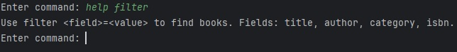

# Manual 

# Start the program by running the LibrisApp.java file.

## Help

### help
“help” will show you options for commands

### help filter
“help filter” will show you options involving the filter command

### help list
“help list” will show you options involving the list command

## Filter

### filter
“filter” will show all library books in sorted by author name.

### filter \<field>~=\<value>
This will show all the books that have equal fields to the value sorted by author name.

The fields are as follows: “bookTitle”, “authorName”, “category”, or “isbn”.

### filter clear
This clears the filter.

## List

### list add \<isbn>
This adds a book to your list using the ISBN number.

### list remove \<isbn>
This removes the book from your list using the ISBN number.

### list
Shows all the items in your list

### list clear
This removes all books in the list.

### list checkout \<isbn>
This checks out a book. If no ISBN is provided, it checks out all books in the list. Checked out books get added to the CSV file “output/checkoutBook.csv” and update the “Library.csv” file. If the book is an illegal book, a password is required to check it out. The password is “secret”.

### list checkin \<isbn>
This checks in a book. If no ISBN is provided, it checks in all the books in the list. This will update the Library.csv file

### exit
"exit" terminates the program.

