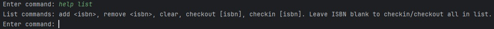
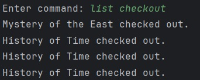

# Manual 

Welcome to the Libris App!

## Start the program by running the LibrisApp.java file.

## Help

### help
“help” will show you options for commands

### help filter
“help filter” will show you options involving the filter command

### help list
“help list” will show you options involving the list command

## Filter

### filter
“filter” will show all library books in sorted by author name.

### filter \<field>~=\<value>
This will show all the books in the list that contain said value in its field.

The fields are as follows: “bookTitle”, “authorName”, “category”, or “isbn”.

### filter \<field>==\<value>
This will show all the books that have equal fields to the value.

The fields are as follows: “bookTitle”, “authorName”, “category”, or “isbn”

### filter \<field>~=\<value>::sort \<sortType> or filter \<field>==\<value>::sort \<sortType>

This is used to sort the filtered list by either book title or author in ascending order. To do this, add ::sort \<sortType> to your filter command. 

Options for sortType are: "bookTitle" or "authorName".

### filter clear
This clears the filter.

## List

### list
Shows all the items in your list.

### list add \<isbn>
This adds a book to your list using the ISBN number.

### list add all
This adds all filtered books to your list.

### list remove \<isbn>
This removes the book from your list using the ISBN number.

### list clear
This removes all books in the list.

### list checkout \<isbn>
This checks out a book in your list. If no ISBN is provided, it checks out all available books in the list. Checked out books get added to the CSV file “output/checkoutBook.csv” and update the “Library.csv” file. If the book is an illegal book, a password is required to check it out. The password is “secret”. If you are checking out all book in the list and one is illegal, the user will be prompted for the password still.

Checkout all books:

Illegal book checkout:

### list checkin \<isbn>
This checks in a book. If no ISBN is provided, it checks in all the books in the list. This will update the Library.csv file.

Checkin all books:

### exit
"exit" terminates the program.

